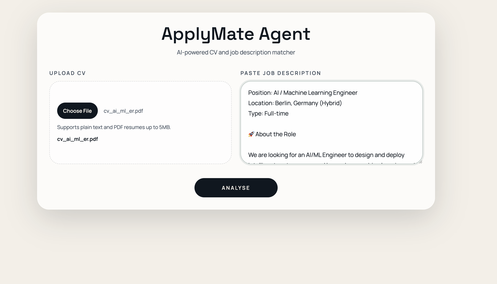
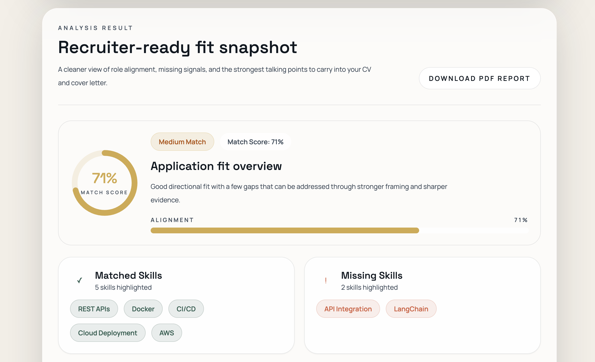
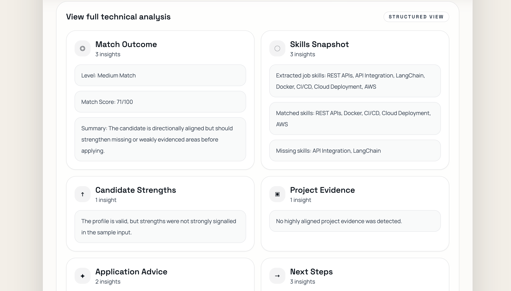
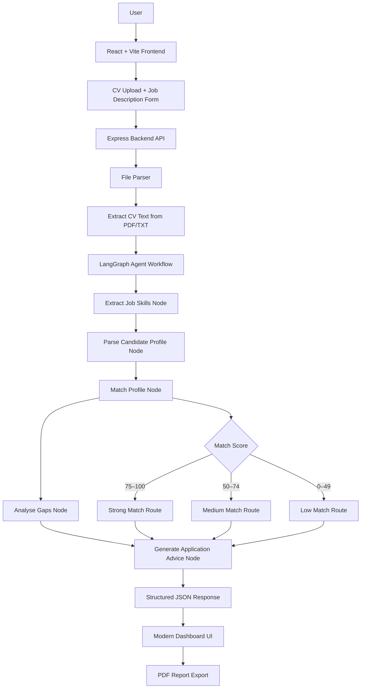

# ApplyMate Agent

A full-stack AI application that evaluates how well a candidate CV aligns with a job description using a LangGraph-based agent workflow.

## Project Overview

ApplyMate Agent helps candidates assess application fit before they apply. Users upload a CV, paste a job description, and receive a structured analysis including match score, aligned skills, missing skills, suggested CV bullets, a cover letter angle, and a technical breakdown of the reasoning.

This project matters because CV-job matching is a practical AI engineering problem: it combines unstructured document input, multi-step reasoning, workflow orchestration, and a user-facing product experience. It is designed to demonstrate modern AI application design beyond a single prompt or chatbot interface.

## Live Demo

`apply-mate-agent.vercel.app`

## Screenshots

### Upload & Analysis Flow


### Results Dashboard


### Technical Analysis View


## Features

- Upload CV files in `.txt` or `.pdf` format
- Parse resume content from uploaded files, including PDF extraction
- Analyse job descriptions against candidate experience
- Run a stateful LangGraph workflow for structured reasoning
- Generate:
  - match score
  - matched skills
  - missing skills
  - suggested CV bullets
  - cover letter angle
  - technical analysis sections
- Download a recruiter-friendly PDF report
- Full-stack integration with a React frontend and TypeScript backend

## Tech Stack

### Frontend

- React
- Vite
- TypeScript
- Tailwind CSS

### Backend

- Node.js
- Express
- TypeScript
- Multer
- pdf-parse
- Zod

### AI / Workflow Stack

- LangGraph
- Stateful workflow orchestration
- Structured output generation
- Deterministic multi-step reasoning pipeline

## Architecture Overview

ApplyMate Agent is split into two clear layers:

- **Frontend**: a React application that handles file upload, job description input, loading and error states, and a structured results dashboard.
- **Backend**: an Express API that accepts multipart form data, parses uploaded CV files, and executes the LangGraph workflow through a reusable `runApplyMateAgent()` function.

The backend separates concerns cleanly:

- upload handling via Multer
- file parsing via a dedicated parser service
- workflow logic isolated in `graph/workflow.ts`
- API layer responsible for validation, orchestration, and response delivery

This structure keeps the system maintainable and makes it easy to extend with richer models, tools, or external integrations later.

## Architecture Diagram



## Agent Workflow

The core analysis is implemented as a LangGraph state graph. Instead of using one monolithic function, the workflow is broken into explicit reasoning steps:

- `extractJobSkills`
  Reads the job description and identifies canonical skills and requirements.
- `parseCandidateProfile`
  Extracts candidate skills and signals from CV text and optional project history.
- `matchProfile`
  Compares required skills against detected candidate strengths and computes a match score.
- `analyseGaps`
  Identifies missing skills and generates improvement guidance.
- `generateApplicationAdvice`
  Assigns the overall match tier.
- Conditional routing
  Routes to `buildStrongMatchReport`, `buildMediumMatchReport`, or `buildLowMatchReport`.

This is a strong example of stateful multi-step reasoning: each node reads and updates shared graph state, and the final output depends on both extracted evidence and score-based routing.

## How It Works

1. The user uploads a CV and pastes a job description.
2. The frontend sends a multipart request to the backend.
3. The backend parses the uploaded file and validates the input.
4. The LangGraph workflow analyses the CV against the role requirements.
5. The API returns structured results to the frontend.
6. The frontend renders a recruiter-friendly dashboard and technical analysis view.
7. The user can export the result as a PDF report.

## Example Output

```text
Match Score: 78%
Match Level: Strong Match

Matched Skills:
- TypeScript
- REST APIs
- LangGraph
- AWS

Missing Skills:
- Docker
- CI/CD

Suggested CV Bullets:
- Built a LangGraph-based application assistant for structured CV-role matching.
- Designed API-driven workflows for document ingestion and analysis output.
- Delivered production-ready TypeScript backend services with validation and file parsing.

Cover Letter Angle:
I am particularly interested in this role because it aligns strongly with my experience in TypeScript, REST APIs, and workflow tooling, while also giving me the opportunity to deepen production delivery ownership.
```

## Installation & Setup

### Run Backend

```bash
cd backend
npm install
npm run dev
```

Backend runs on:

```bash
http://localhost:4000
```

### Run Frontend

```bash
cd frontend
npm install
npm run dev
```

Frontend runs on:

```bash
http://localhost:5173
```

## Future Improvements

- MCP server integration for tool-driven enrichment
- Authentication and saved user sessions
- Historical dashboard for previous analyses
- LinkedIn job post parser
- Richer skill taxonomy and semantic matching
- Persistent storage for report history

## Why This Project Matters

ApplyMate Agent reflects real-world AI engineering concerns:

- orchestrating reasoning as a workflow, not a single model call
- handling messy user inputs such as resumes and PDFs
- converting unstructured text into structured, useful output
- integrating AI-style reasoning into a complete product surface
- designing for both end-user clarity and backend maintainability

For an AI/ML Engineer role, this project demonstrates practical workflow design, full-stack delivery, document handling, and structured reasoning systems in a concrete product use case.

## Author

**Name:** Arjun Acharya  
**LinkedIn:** [https://www.linkedin.com/in/arjunacharya55/](https://www.linkedin.com/in/arjunacharya55/)  
**GitHub:** [https://github.com/arjun28-ach/ApplyMate-Agent.git](https://github.com/arjun28-ach/ApplyMate-Agent.git)
